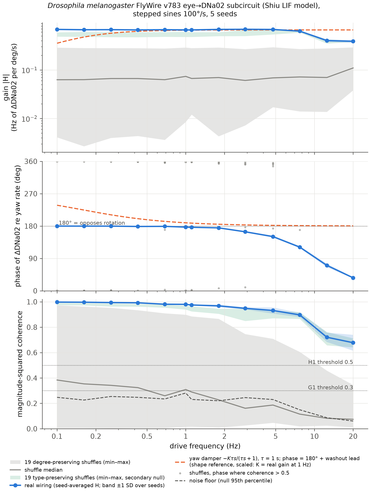
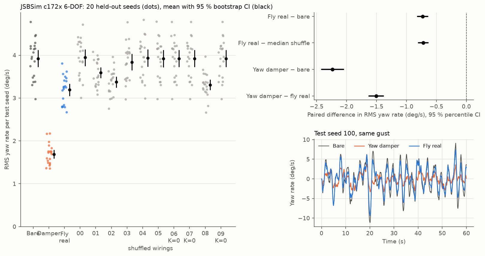
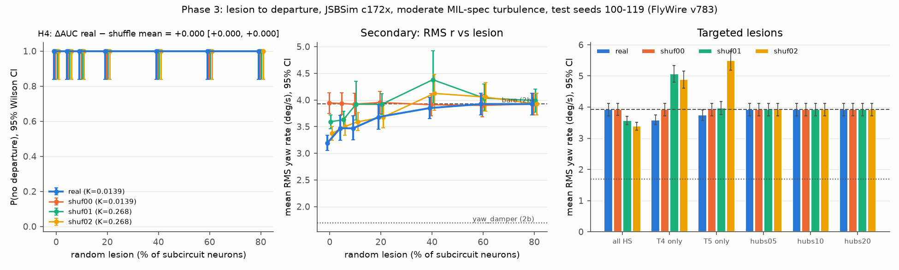

# Flight-test the fly

Code and data for **"Flight-testing a fruit-fly connectome as an aircraft yaw damper"**: a spiking model of the FlyWire v783 eye-to-steering pathway, evaluated as a rudder yaw damper with standard flight-control methods.

## Summary

We extracted from the FlyWire v783 connectome every neuron on a path of at most 4 hops (edges of at least 5 synapses) from the motion-detecting T4/T5 cells to the steering descending neurons DNa02 and DNg02, together with all edges among them (20,556 neurons, 251,358 simulated edges). The subcircuit was simulated with the leaky integrate-and-fire model and parameters of Shiu et al. (2024), with the fixed-rate input replaced by T4/T5 Poisson rates that follow the aircraft's yaw rate. The rudder command is a single gain on the washed-out difference of right and left DNa02 firing.

The controller was characterised as a flight-control law: open-loop frequency response (Phase 1), closed-loop gust rejection in MIL-F-8785C Dryden turbulence on a 2-state Dutch-roll model and on the JSBSim Cessna 172 (c172x) 6-DOF model (Phase 2), and degradation under neuron loss (Phase 3). Every result is compared against degree- and sign-preserving shuffles of the wiring, the bare airframe and a classical washout yaw damper tuned with the same procedure and budget. Hypotheses, metrics, thresholds and seed splits were fixed before data collection.

In this model, the steering signal follows yaw rotation coherently and with the stabilizing sign, and the real wiring outperforms every shuffle in both open and closed loop. Most of the response is carried by cell-type- and side-level connectivity. The fly controller reduces yaw-rate RMS by 14-19% relative to the bare airframe; the classical yaw damper reduces it by 52-57%. The lesion hypothesis (H4) could not be tested, because no flight departed controlled flight.

## Key results

All values are from held-out seeds; brackets are 95% percentile bootstrap CIs over paired test seeds.

| Hypothesis | Measure | Result | Verdict |
| --- | --- | --- | --- |
| H1, open loop | 1 Hz coherence of DNa02 R − L with yaw rate: real vs 19 degree-preserving shuffles | 0.980 vs median 0.31, max 0.90; rank 1 of 20, p = 0.05 | Supported |
| H1, open loop | 1 Hz gain (Hz per deg/s): real vs 19 degree-preserving shuffles | 0.666 vs median 0.075, max 0.29; rank 1 of 20, p = 0.05 | Supported |
| H1, secondary | 1 Hz coherence / gain vs 19 type-preserving shuffles | 0.980 vs max 0.970; 0.666 vs max 0.61; rank 1 of 20, p = 0.05 | Small margin |
| H2, 2-state model | RMS yaw rate, fly − bare | -0.45 °/s [-0.53, -0.36] (-14%) | Supported |
| H3, JSBSim 6-DOF | RMS yaw rate, fly − bare | -0.73 °/s [-0.81, -0.64] (-19%) | Supported |
| H2b / H3 | RMS yaw rate, real − median shuffle (2-state; JSBSim) | -0.44 °/s [-0.53, -0.36]; -0.72 °/s [-0.80, -0.64]; lowest of 11 wirings on both, p = 1/11 | Supported, with caveat |
| Reference | RMS yaw rate, yaw damper − fly (2-state; JSBSim) | -1.15 °/s [-1.27, -1.04]; -1.51 °/s [-1.63, -1.39] | Damper better |
| H4, lesions | Departures in 1,040 lesioned flights | 0 of 1,040; ΔAUC = 0 [0, 0] | Untestable |

Mean RMS yaw rate on the 20 test seeds (100-119), moderate Dryden turbulence, 60 s flights:

| Controller | 2-state model | JSBSim 6-DOF |
| --- | --- | --- |
| No controller (bare airframe) | 3.09 °/s | 3.92 °/s |
| Classical yaw damper (K = 7.2) | 1.50 °/s | 1.69 °/s |
| Fly brain, real wiring (K = 0.0139 per Hz) | 2.65 °/s | 3.19 °/s |
| Best scrambled wiring | 2.91 °/s (fly_shuffle_02) | 3.31 °/s (fly_shuffle_08) |

Further results:

- **Response shape (real wiring).** Coherence is 0.968-0.998 at every frequency ≤ 2 Hz (noise-only null 95th percentile 0.22-0.28). The phase is 177.0-179.9° at f ≤ 1 Hz, i.e. DNa02 R − L is in antiphase with the yaw rate. The gain is 0.666-0.686 Hz per deg/s up to 4.8 Hz and, relative to 1 Hz, -0.5 dB at 7.7 Hz and -4.4 dB at 12.5 Hz. The phase lag fits a pure delay of about 22 ms (21.6 ms; exploratory fit at f ≥ 2 Hz).
- **Margins at the selected gains** (2-state, by actuator injection). Fly: gain margin 34.5 dB, with |L| < 1 at every tested frequency (no gain crossover, phase margin undefined). Yaw damper: GM 31.9 dB, PM 61.3°. The fly loop is admissible because it is low-gain, not because it is fast.
- **Relay controllers.** On JSBSim, scrambled wirings 01, 02 and 08 selected K = 0.268, where the rudder command is saturated in about 100% of steps. They fly a steady skidding turn: mean RMS sideslip 7.1-7.4°, against 2.01° for the bare airframe, 1.73° for the yaw damper and 1.77° for the real wiring. Ranked by RMS sideslip (secondary), the real wiring is lowest of all 11 wirings on both plants.
- **Lesions (secondary, JSBSim).** Mean RMS yaw rate of the real wiring rises from 3.19 °/s intact to 3.47 °/s at 5%, 3.68 °/s at 20% and 3.85 °/s at 40% random silencing, and equals the bare value (3.92 °/s) from 60%. It is never worse than the bare airframe (fails passive). Relay-type scrambles become worse than bare under some lesions (up to 5.49 °/s). Silencing the 6 HS cells returns the real wiring exactly to the bare value.
- **Exploratory, input gain g = 4** (2-state only): fly − bare = -1.01 °/s [-1.17, -0.87].

## Figures



*Figure 1. Open-loop gain, phase and coherence of DNa02 R − L versus yaw rate: real wiring (blue), 19 degree-preserving shuffles (grey band), 19 type-preserving shuffles (green band), and a first-order washout yaw damper scaled for shape (dashed).*



*Figure 2. JSBSim c172x 6-DOF in moderate Dryden turbulence: RMS yaw rate per held-out seed for each controller, paired differences with 95% CIs, and yaw-rate traces for test seed 100.*



*Figure 3. Lesions on JSBSim: probability of no departure versus random-lesion fraction (H4), mean RMS yaw rate versus lesion fraction, and targeted lesions, for the real wiring and three shuffles at their fixed Phase 2b gains.*

The 2-state closed-loop figure is `results/fig_phase2a.png`; the exploratory amplitude sweep is `results/fig_phase1_amp.png`.

## Interactive replay and paper

The `app/` folder is a static three.js viewer with no build step. It replays recorded flights (real wiring, yaw damper, shuffled wirings and lesioned controllers in the same gust) next to the group firing rates and spike raster that produced them, and contains a typeset write-up of the study.

```bash
npx serve app        # then open the printed URL
```

Alternatively, open `app/index.html` directly; the recordings are also bundled in `app/runs/bundle.js` for `file://` use.

### Recording format

One JSON file per flight in `app/runs/` (≤ 5 MB), listed in `app/runs/manifest.json`:

| Key | Content |
| --- | --- |
| `meta` | controller, aircraft (`c172x`), plant (`lin2` or `jsbsim`), seed, turbulence, lesion `{kind, fraction}`, gain `K`, `dt`, `data_version` (`flywire_v783`), creation time |
| `t` | time (s) |
| `pos_ned_m`, `euler_rad` | position (north, east, down; m) and Euler angles (φ, θ, ψ; rad) |
| `r`, `beta`, `rudder`, `gust` | yaw rate (rad/s), sideslip (rad), rudder command in [-1, 1] (+ = nose-right, 1 = 16°), gust velocity [u, v, w] (m/s) |
| `groups` | mean firing rate (Hz) per control step for T4T5, HS, VS and DNa02, left and right |
| `raster` | `neurons` (index, cell type, side) and `spikes` as `[t_s, index]` |
| `metrics` | `rms_r`, `rms_beta`, `max_abs_phi`, `departed`, `rms_rudder` |

`scripts/make_mock_runs.py` validates this format and rebuilds the bundle.

## Repository layout

```
.github/workflows/sweep.yml    sharded sweep on GitHub-hosted runners (one matrix job per shard)
app/
  index.html, app.js           replay workbench (three.js)
  guide.js, paper.css          typeset write-up shown below the workbench
  brain3d.js                   3D view of the FlyWire neuron positions
  runs/                        flight recordings (seed 100), manifest.json, bundle.js
  data/                        summary.json (every number the write-up shows, with its source), brain3d.*
data/
  sub/subcircuit_v783_t5.npz   extracted subcircuit (derived from FlyWire v783; enough for every sweep)
  raw/                         FlyWire / Shiu source files (not distributed; see below)
results/                       result files and figures; shards/ holds per-job outputs
  shards_superseded/           Phase 1 shards from the mis-built null (kept, not reported)
scripts/
  00_pathway_check.py          does the T4/T5 -> HS/VS -> DNa02 pathway exist in v783
  brain.py                     subcircuit extraction, time-varying input, Shiu LIF model in Brian2, fly controller
  plant.py                     JSBSim c172x trim and linearisation, 2-state plant, Dryden gusts, 6-DOF wrapper, loop margins
  baselines.py                 bare airframe, washout yaw damper, shared tuning procedure
  nulls.py                     degree-preserving and type-preserving shuffles, lesion sets
  stats.py                     lock-in transfer function, coherence, bootstrap CIs, permutation tests, departure AUC
  run_phase{1,2,3}.py          sharded experiment drivers
  analyze_phase{1,2,3}.py      merge shards, apply the pre-registered tests, write results and figures
  validate_fullbrain.py        subcircuit vs full-brain check (needs data/raw)
  subcircuit_stats.py          HS input composition, edge totals, net signed weight per null
  export_app_summary.py        numbers for the write-up -> app/data/summary.json
  export_brain_points.py       neuron positions -> app/data/brain3d.*  (needs data/raw)
  make_mock_runs.py            recording-format validator, bundle builder, mock runs for viewer development
  run_toy.py                   2-shard toy job for testing the workflow
pyproject.toml, uv.lock        Python environment
```

## Reproducing the results

### Environment

Python 3.11 managed with [uv](https://docs.astral.sh/uv/). Pinned in `uv.lock`: Brian2 2.9.0, JSBSim 1.3.1, numpy < 2.3 (Brian2 2.9.0 fails on numpy 2.4).

```bash
uv sync
```

### Data

The committed subcircuit `data/sub/subcircuit_v783_t5.npz` is sufficient for all sweeps and analyses. The raw files are needed only to rebuild it (`scripts/brain.py --extract`), for the pathway check, the full-brain validation and the 3D brain export. Download them into `data/raw/`:

```bash
mkdir -p data/raw && cd data/raw
# Shiu et al. 2024 model repository, commit 91bdd1e (FlyWire v783 connectivity)
curl -LO https://raw.githubusercontent.com/philshiu/Drosophila_brain_model/91bdd1e7dcf193f3e7ca5a8933497fcef63b7960/Connectivity_783.parquet
curl -LO https://raw.githubusercontent.com/philshiu/Drosophila_brain_model/91bdd1e7dcf193f3e7ca5a8933497fcef63b7960/Completeness_783.csv
# FlyWire neuron annotations (Schlegel et al. 2024), supplemental file 1
curl -L -o flywire_annotations.tsv \
  https://raw.githubusercontent.com/flyconnectome/flywire_annotations/main/supplemental_files/Supplemental_file1_neuron_annotations.tsv
```

`Connectivity_783.parquet` has 15,091,983 rows; the annotation table has 139,248 neurons.

### Local self-checks

Every script ends with an assert-based self-check. Run one Brian2 process at a time.

```bash
uv run python scripts/00_pathway_check.py        # -> results/00_pathway_check.txt (needs data/raw)
uv run python scripts/brain.py                   # spiking model
uv run python scripts/plant.py                   # plant, turbulence and sign checks (rewrites results/plant_*.json)
uv run python scripts/baselines.py               # yaw damper and tuning (rewrites results/baselines_yaw_damper.json)
uv run python scripts/nulls.py
uv run python scripts/stats.py
uv run python scripts/run_phase1.py --smoke
uv run python scripts/run_phase2.py --smoke
uv run python scripts/run_phase3.py --smoke
uv run python scripts/analyze_phase1.py --selfcheck
uv run python scripts/analyze_phase2.py --selfcheck
uv run python scripts/analyze_phase3.py --selfcheck
```

### Cloud sweeps

The sweeps were run on GitHub-hosted runners via `.github/workflows/sweep.yml`. Each shard runs `scripts/<script> --shard i --n-shards N <args>` and uploads its JSON files as an artifact. Outputs depend only on the job and its seed, not on the number of shards. The shard counts below are those used for the reported results.

```bash
# Phase 1: Bode sweep, g sensitivity and amplitude sweep (real, 19 + 19 shuffles, seeds 0-4)
gh workflow run sweep.yml -f script=run_phase1.py -f n_shards=50

# Phase 2: tuning on train seeds 0-9
gh workflow run sweep.yml -f script=run_phase2.py -f n_shards=45 -f args="--stage tune --plant lin2"
gh workflow run sweep.yml -f script=run_phase2.py -f n_shards=23 -f args="--stage tune --plant jsbsim"
gh workflow run sweep.yml -f script=run_phase2.py -f n_shards=10 -f args="--stage tune --plant lin2 --signflip"
gh workflow run sweep.yml -f script=run_phase2.py -f n_shards=10 -f args="--stage tune --plant jsbsim --signflip"
# grid widening (pre-registered edge rule; the two new K values only)
gh workflow run sweep.yml -f script=run_phase2.py -f n_shards=12 -f args="--stage tune --plant lin2 --k-min 9"
gh workflow run sweep.yml -f script=run_phase2.py -f n_shards=6  -f args="--stage tune --plant jsbsim --k-min 9"
gh workflow run sweep.yml -f script=run_phase2.py -f n_shards=3  -f args="--stage tune --plant lin2 --signflip --k-min 9"
gh workflow run sweep.yml -f script=run_phase2.py -f n_shards=3  -f args="--stage tune --plant jsbsim --signflip --k-min 9"
uv run python scripts/run_phase2.py --stage select     # local -> results/phase2_selection.json (commit before testing)

# Phase 2: test seeds 100-119 at the selected gains
gh workflow run sweep.yml -f script=run_phase2.py -f n_shards=6 -f args="--stage test --plant lin2"
gh workflow run sweep.yml -f script=run_phase2.py -f n_shards=4 -f args="--stage test --plant jsbsim"
gh workflow run sweep.yml -f script=run_phase2.py -f n_shards=2 -f args="--stage test --plant lin2 --signflip"
gh workflow run sweep.yml -f script=run_phase2.py -f n_shards=2 -f args="--stage test --plant jsbsim --signflip"

# Phase 3: lesions (reads results/phase2_selection.json)
gh workflow run sweep.yml -f script=run_phase3.py -f n_shards=20

# collect: one artifact folder per shard, flattened into results/shards/
gh run download <run-id> -D results/shards_dl
find results/shards_dl -name '*.json' -exec cp {} results/shards/ \;
```

`--signflip` runs the pre-registered secondary analysis, in which each wiring uses the sign identified from its own open-loop response; it needs `results/phase1_bode.json`. `run_phase3.py --plan` prints the Phase 3 job count and CPU estimate.

### Analysis

```bash
uv run python scripts/analyze_phase1.py     # -> results/phase1_bode.json, phase1_summary.md, fig_phase1_bode.png, fig_phase1_amp.png
uv run python scripts/analyze_phase2.py     # -> results/phase2a_metrics.json, phase2b_metrics.json, fig_phase2a.png, fig_phase2b.png
uv run python scripts/analyze_phase3.py     # -> results/phase3_lesions.json, fig_phase3_departure.png
uv run python scripts/subcircuit_stats.py   # -> results/subcircuit_stats.json
uv run python scripts/validate_fullbrain.py # -> results/phase1_fullbrain_check.json (local, a few minutes, needs data/raw)

# viewer data
uv run python scripts/analyze_phase2.py --app
uv run python scripts/analyze_phase3.py --app
uv run python scripts/export_app_summary.py --bundle
```

Each per-job result file records its seed, the git commit of the code and the data version (`flywire_v783`). JSBSim turbulence uses an implementation-defined C++ random number generator, so a given seed can differ between macOS and Linux; all reported JSBSim runs were made on the Linux runners.

## Pre-registration and deviations

**Fixed before data collection.**

- **H1 (open loop).** Driven by sinusoidal yaw rotation, DNa02 right − left firing follows the rotation with coherence > 0.5 at ≤ 2 Hz, with the sign opposing the rotation. Test: 1 Hz coherence and gain of the real wiring against degree-preserving shuffles, one-sided permutation test, α = 0.05.
- **H2 (2-state closed loop).** In Dryden gusts, the fly controller lowers RMS yaw rate against the bare airframe on held-out seeds (95% bootstrap CI of the paired difference excludes 0). **H2b:** the real wiring beats the median shuffle under identical tuning.
- **H3 (JSBSim 6-DOF).** H2 and H2b hold for the JSBSim c172x in MIL-spec Dryden turbulence (moderate).
- **H4 (lesions).** The real wiring has a larger area under the no-departure curve than shuffles as neurons are silenced. Departure: |φ| > 60°, |β| > 20° or |r| > 60°/s held for more than 1 s.
- **Fixed choices.** 5 ms rate bins; lock-in gain and phase; `scipy.signal.coherence` with one drive cycle per segment; train seeds 0-9 for tuning only, test seeds 100-119 for reporting only; shuffles preserve in- and out-degree, edge weights and each neuron's sign.

**Deviations and additions, each recorded with its reason before the affected data were collected unless stated otherwise.**

1. **2-state Phase 2a plant.** A 2-state (β, r) Dutch-roll model linearised from JSBSim c172x replaced the planned 1-state yaw model, which has no Dutch-roll mode and would make the yaw-damper comparison meaningless.
2. **Readout.** `rudder = sat(K · washout(Δ − b))`, with Δ = DNa02_R − DNa02_L, b a warm-up bias estimate, K ≥ 0 and the sign fixed by biology. The 1 s washout matches the yaw damper, so the two controllers differ only in sensor and processing.
3. **Phase 1 protocol.** 19 shuffles instead of 10, because the smallest attainable p with n shuffles is 1/(n + 1); at least 10 cycles per frequency instead of 5, because the coherence noise floor at 5 cycles (95th percentile 0.47) overlapped the thresholds; 1 Hz added as a 13th test frequency.
4. **Tuning rule.** Minimum train RMS yaw rate subject to no departure and loop margins GM ≥ 6 dB and PM ≥ 45° (MIL-F-9490D), for every controller. The unconstrained optimum for the yaw damper was an unstable, chattering gain (GM −2.4 dB). Phase 2b reuses the margin-admissible gains from the 2-state model.
5. **Exploratory arms,** labelled as such: a 1 Hz amplitude sweep (3-100 deg/s) and a 2-state closed loop at input gain g = 4.
6. **Null rebuilt (after Phase 1 data).** The first shuffles were drawn on all 283,576 extracted edges, including the 32,218 edges into T4/T5 cells that the simulation discards; this gave the shuffles about 4× the real net inhibition. The null was rebuilt on the 251,358 simulated edges and Phase 1 was rerun. The real-wiring runs reproduced bit-identically. The superseded shards are kept in `results/shards_superseded/` and none of their numbers are reported.
7. **Secondary type-preserving null (added after Phase 1 data).** Swaps are restricted to targets of the same side and cell type. It is reported separately and is not the pre-registered H1 test.
8. **Code fixes before any Phase 2 or 3 data was used.** A causal readout (one control step, 10 ms, of transport delay); true silencing of lesioned neurons, which previously could still be read out; one margin protocol for every controller (17 injected sines plus the Nyquist frequency, 20 s settling); a JSBSim seed offset, because JSBSim 1.3.1 maps seeds 0 and 1 to the same turbulence. Phase 2 sweeps run before these fixes were cancelled and discarded.
9. **Grid widening.** The pre-registered edge rule triggered on JSBSim (best K on the upper grid edge for three shuffles). Every grid was extended once by 2 points at the same log step, keeping the budget equal (11 points per controller), with a rule not to widen again.
10. **Seed disclosure.** One 3 s plumbing test used test seed 100 with a placeholder gain before Phase 2; it was not used for tuning or selection.
11. **Not run.** The optional F450 quadcopter variant and the severe-turbulence sweep.

## Limitations

- **A model, not a fly.** The results describe FlyWire v783 simulated with the Shiu et al. LIF model. That model was validated on v630 and not on visual neurons. It omits gap junctions (HS-H2 coupling is largely electrical) and graded potentials (T4/T5, HS and VS are graded cells). No published Drosophila yaw Bode plot was found for comparison.
- **Synapse counts as weights.** Absolute gains (Hz per deg/s) have no physiological meaning; only phase, bandwidth and comparisons between wirings do.
- **Input encoding.** T4/T5 rates are linear in |yaw rate| (10 Hz baseline, 1 Hz per deg/s), with no temporal-frequency tuning.
- **Near-threshold operation.** Resting DNa02 rates are 1.4 Hz (left) and 0 Hz (right). At 1 Hz, coherence falls from 0.98 at 100 deg/s to 0.67 at 3 deg/s, the range of yaw rates seen in turbulence.
- **Subcircuit vs full brain.** The subcircuit keeps the full-brain phase within 4° but its gain is 15-17% lower at 0.5-2 Hz and 36% lower at 8 Hz (2 seeds, `results/phase1_fullbrain_check.json`).
- **Readout.** One gain K maps DNa02 R − L to the rudder. DNa02's steering role is shown in walking flies; for flight there is connectivity evidence only.
- **Turbulence differs between plants.** The 2-state model uses a second-order Dryden filter; JSBSim 1.3.1 uses a first-order approximation with about 4/3 of the power near the Dutch roll. The two plants are not a like-for-like turbulence comparison.
- **Margins** were measured on the 2-state model only and reused for JSBSim.
- **Primary metric.** RMS yaw rate admitted relay controllers that fly a steady skidding turn. A future protocol should also constrain mean rudder, sideslip or heading drift.
- **H4 design.** The bare C172 with a wings-level hold does not depart in moderate turbulence, so the departure test could not separate wirings. The top-betweenness hub sets contain both DNa02 readout neurons and all HS cells, which makes the hub lesions uninformative by construction.
- **Scale of the comparison.** p-values are at their floors (1/20 for Phase 1, 1/11 for Phase 2); the real wiring is one sample of one connectome.

## Planned next study: path holding and multi-axis control

The experiments above treat the fly circuit as a yaw damper: an inner loop that damps gust-driven yaw oscillation. A yaw damper's washout deliberately passes steady turns, so neither the fly controller nor the classical damper tries to hold heading or track, and flight-path drift was not a pre-registered metric. Path drift is known only for the one replayed gust (Fig. 4 of the paper). The next study asks whether connectome-derived control can hold a flight path, the way an autopilot or fly-by-wire flight control system is judged. It will be pre-registered before any data are collected.

1. **Path drift for the existing controllers.**
   - Rerun the 20 held-out test gusts saving heading, cross-track and altitude.
   - Report heading error, cross-track error and their 95% bootstrap intervals for no controller, the yaw damper, the real wiring and the scrambled wirings.
2. **Heading and track hold.**
   - Wrap a conventional outer loop (heading hold, then cross-track hold) around each inner loop: none, the classical yaw damper, and the fly controller.
   - Tune the outer loop with one rule for all.
   - Compare RMS heading and cross-track error, control activity and stability margins.
3. **Recovery after a disturbance.**
   - Apply standard inputs: a rudder doublet, a step side gust and a discrete (1 − cos) gust.
   - Measure overshoot, settling time and whether the aircraft returns to its heading and track.
4. **Roll and pitch.**
   - The current subcircuit is the yaw pathway (T4/T5 → HS → DNa02). Aileron and elevator control need other circuits: the VS cells respond to roll and pitch rotation, and other descending neurons (for example DNg02, linked to wingbeat amplitude) are candidates for readouts.
   - Extract those pathways with the same rules, test them open loop, then close them around the aileron or elevator.
   - The fallback is a hybrid: the fly yaw loop inside conventional roll, pitch and path loops.
5. **Comparison with conventional control.**
   - Compare against a classical PID or stability-augmentation design for each axis, tuned with the same margin-constrained procedure.
6. **Robustness.**
   - Sweep CG and loading. The current runs use one loading, with the CG 4.2 in right of centre.
   - Add severe turbulence and a less stable airframe, so that the lesion test can produce departures.
   - Exclude the readout neurons from hub lesion sets.
   - Add a constraint on mean rudder or sideslip, so that relay-like controllers cannot win on yaw rate alone.

## Citation

```bibtex
@misc{aryawijaya2026flighttest,
  author       = {Aryawijaya, Mutaqin},
  title        = {Flight-testing a fruit-fly connectome as an aircraft yaw damper},
  year         = {2026},
  howpublished = {\url{https://github.com/aryawidjaja/flight-test-the-fly}},
  note         = {Code and data}
}
```

## Licence and credits

Code licence: to be decided by the author.

- **Connectome data.** FlyWire Consortium, connectome v783, [CC BY 4.0](https://creativecommons.org/licenses/by/4.0/). Dorkenwald, S. et al. Neuronal wiring diagram of an adult brain. *Nature* 634, 124-138 (2024). Schlegel, P. et al. Whole-brain annotation and multi-connectome cell typing of *Drosophila*. *Nature* 634, 139-152 (2024). `data/sub/subcircuit_v783_t5.npz` and `app/data/brain3d.*` are derived from these data.
- **Spiking model.** Shiu, P. K. et al. A *Drosophila* computational brain model reveals sensorimotor processing. *Nature* 634, 210-219 (2024). Code: [philshiu/Drosophila_brain_model](https://github.com/philshiu/Drosophila_brain_model) (MIT); its parameters are reused in `scripts/brain.py`.
- **Flight dynamics.** [JSBSim](https://github.com/JSBSim-Team/jsbsim) (LGPL), c172x aircraft model.
- **Viewer.** [three.js](https://threejs.org) (MIT).
